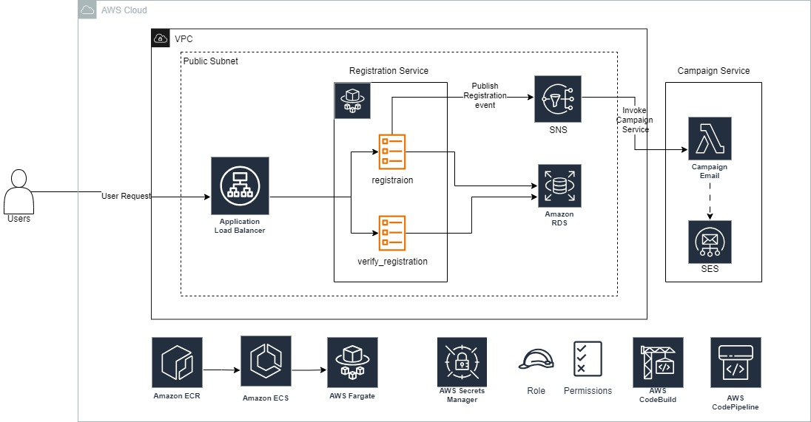

# e_commerce Application

e_com is a hypothetical e_commerce application. The goal is to have a software platform that can manage an e_commerce companies and all the basic functions that it should have.
This application will keep evolving as features are added. This documentation will also be updated in accordance. 

## Architecture Diagram

### Design Details

The application is built using microservices architecture i.e. the application consists of multiple decoupled services.
Currently, as per the architecture diagram there are two services:
    - Registration Service
    - Campaign Service

### Registration Service
GitHub Repo - [Registration Service Repo](https://github.com/sharayu-potuwar/e-commerce_business-registration-service)

This service is responsible for managing the customer registration. The service is built in Python using FastAPI framework and is deployed to the Amazon ECS Fargate.
It utilizes an application loadbalancer as its endpoint using which user can access the application. Please note that currently there is no frontend that is built for the app and the way to interact with the app is by using the Swagger endpoint.
The registration service has 2 endpoints - 
    - customer-registration - Users will input their personal details with the email address and upon submission the user will be registered by creating an entry in the postgreSQL RDS database. This also publishes a message to SNS topic which subsequently triggers the campaign service which we will discuss about further in the document.
    - verify-registration -  This endpoint can be used to verify if the user is already registered or not.

### Campaign Service
GitHub Repo - [Campaign Service Repo](https://github.com/sharayu-potuwar/e-commerce_business-campaign-service)

Goal of this service is to send an email to a newly registred user with all the campaigns and offers that are ongoing in the platform, as soon as the registration is done.
This service is built in an event-driven manner using integration of SNS and AWS Lambda. The service utilizes SES service to send the email.

### Infrastructure Management
GitHub Repo - [Terraform Repo](https://github.com/sharayu-potuwar/e-commerce_business-infra)

The infrastruture is managed Via Terraform. This helps in tearing down the entire environment and services when its not being used and in turn save cost.

### Deployments
The

Following features have been implemented considering the best practises of a [12 factor app](https://12factor.net/)
- Each Service is maintained in its own github repository
- Each Service has its own CICD pipeline
- Dependencies are speecified explocitly using requirements.txt file
- Cloud Native Services are being used
- Services are decoupled from each other, interaction between the existing services is happening through SNS (a publisher subscriber model)
- Concurrency is ensured using services like ECS Fargate and AWS Lambda
- Multiple environments are deployed using the same codebase
- Logs are stored centrally to CloudWatch in separate Log Groups per service
